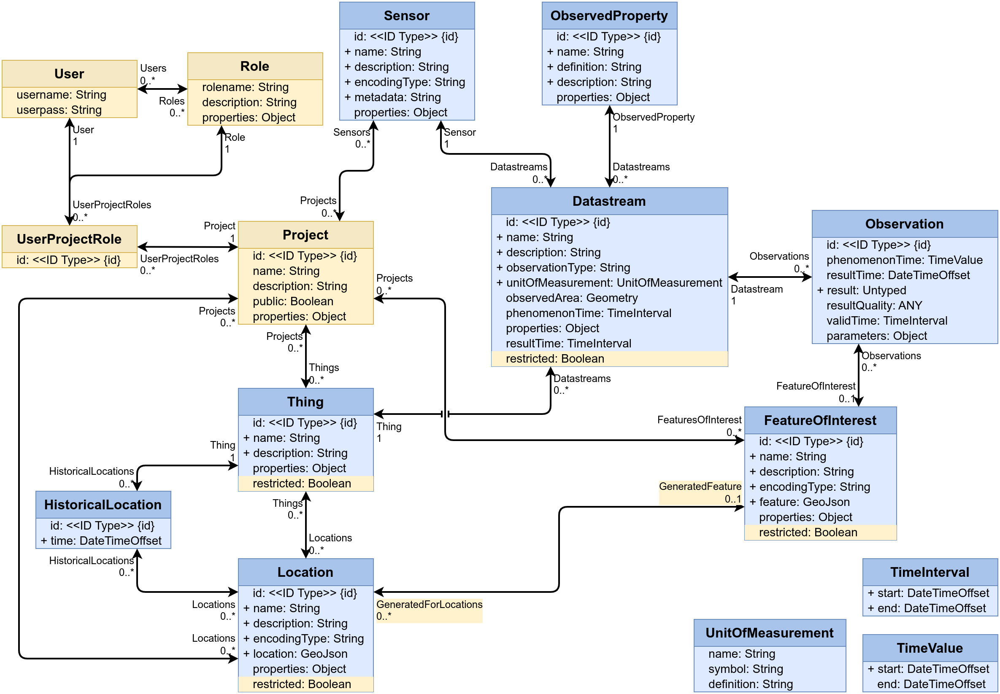

# DCAT Data Model Plugin

Extension to define mappings of sensor data to a [DCAT-AP Specification 3.0](https://www.dcat-ap.de/def/dcatde/3.0/spec/) compliant description. 

## Description

A SensorThings API server, like the FROST-Server, is designed to provide datastreams for various application domains and aims to support the FAIR data principles for making research data Findable, Accessible, Interoperable, and Reusable. In order to make the content of a FROST-Server findable, this data model plugin provides the means to export some of the STA data, as a [DCAT-AP Specification 3.0](https://www.dcat-ap.de/def/dcatde/3.0/spec/)  compliant catalogue description. The catalogue will be provided as an harvestable file, containing the descriptions of the published data sets. 

## Data Model

The image below shows the core STA data model in blue, with the DCAT extension in yellow.

TODO: create image

## Example Data

TODO: Illustrative example, like the DAKIMO datastream.

## Conformance Class

The DCAT-AP data model is compliant to the Specification 3.0:

    https://www.dcat-ap.de/def/dcatde/3.0/spec/

The conformance class this extension registers in the SensorThings (v1.1 and up) index document is:

    https://fraunhoferiosb.github.io/FROST-Server/extensions/DataModel-Projects.html

