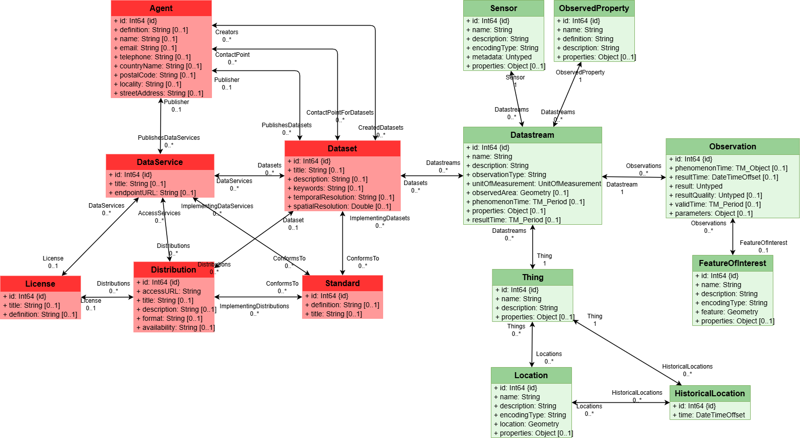
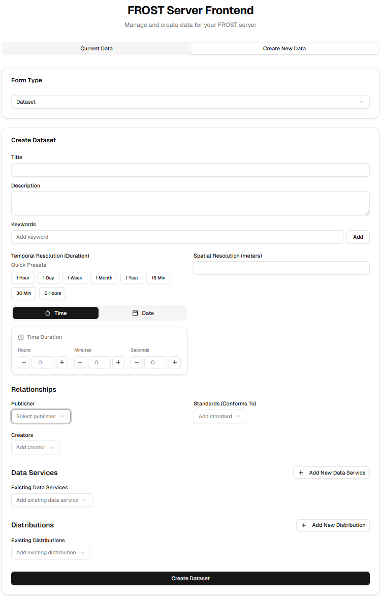

# DCAT Data Model Plugin

Extension to define mappings of sensor data to a [DCAT-AP Specification 3.0](https://www.dcat-ap.de/def/dcatde/3.0/spec/) compliant description. 

## Description

A SensorThings API server, like the FROST-Server, is designed to provide datastreams for various application domains and aims to support the FAIR data principles for making research data Findable, Accessible, Interoperable, and Reusable. In order to make the content of a FROST-Server findable, this data model plugin provides the means to export some of the STA data, as a [DCAT-AP Specification 3.0](https://www.dcat-ap.de/def/dcatde/3.0/spec/)  compliant catalogue description. The catalogue will be provided as an harvestable file, containing the descriptions of the published data sets. 

## Data Model

The image below shows the data elements added by the DCAT Data Model. The extension classed are schon in red and the STA classes are shown in green. The connection between the DCAT extension and the STA core datamodel is realized by linking  __DCAT:Dataset__ class the __STA:Datastream__ class from the core STA data model.

## Installation and Usage 

### Installation

The DCAT data model extension must be enabled in the FROST-Server configuration. See https://fraunhoferiosb.github.io/FROST-Server/settings/plugins.html for details.

TODO: Add enable token documenation into settings file.

### DCAT-Export

TODO: explain how the data export will be used, like

    https://kia-frost-exporter.k8s.ilt-dmz.iosb.fraunhofer.de/dcat

### Frontend

The DCAT extension data can be maintained by the standard API functions. A simple frontend is also available for interactive editing. The image below shows the first version of the web-based editor.

## Conformance Class

The DCAT-AP data model is compliant to the Specification 3.0:

    https://www.dcat-ap.de/def/dcatde/3.0/spec/

The conformance class this extension registers in the SensorThings (v1.1 and up) index document is:

    https://fraunhoferiosb.github.io/FROST-Server/extensions/DataModel-Projects.html

## Acknowledgment
This work was funded by the Ministry of Economic Affairs, Labour and Tourism Baden‑Württemberg within the framework of the AI Alliance Baden‑Württemberg (KI‑Allianz BW, project "Datenplattform").
