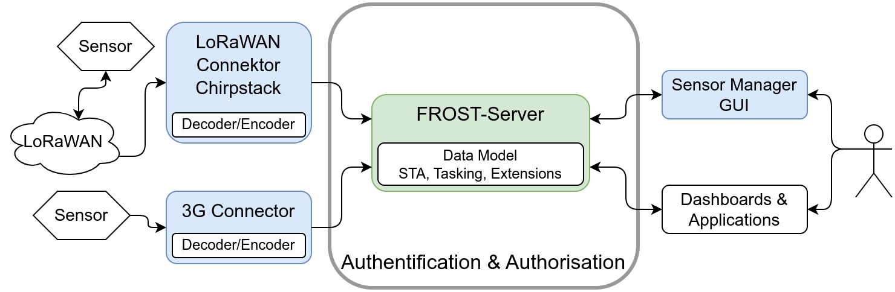
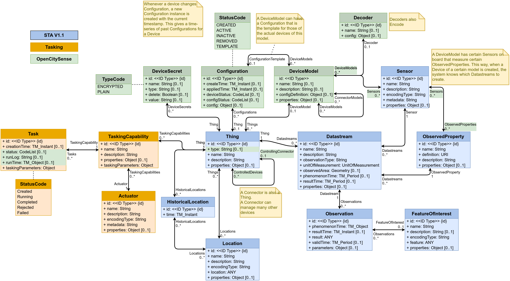
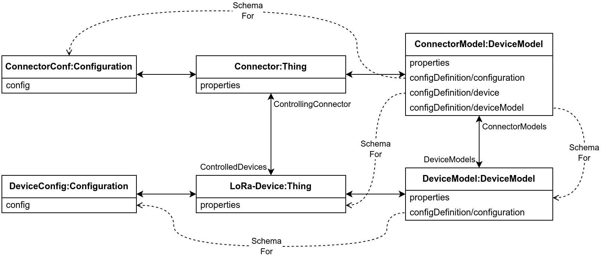
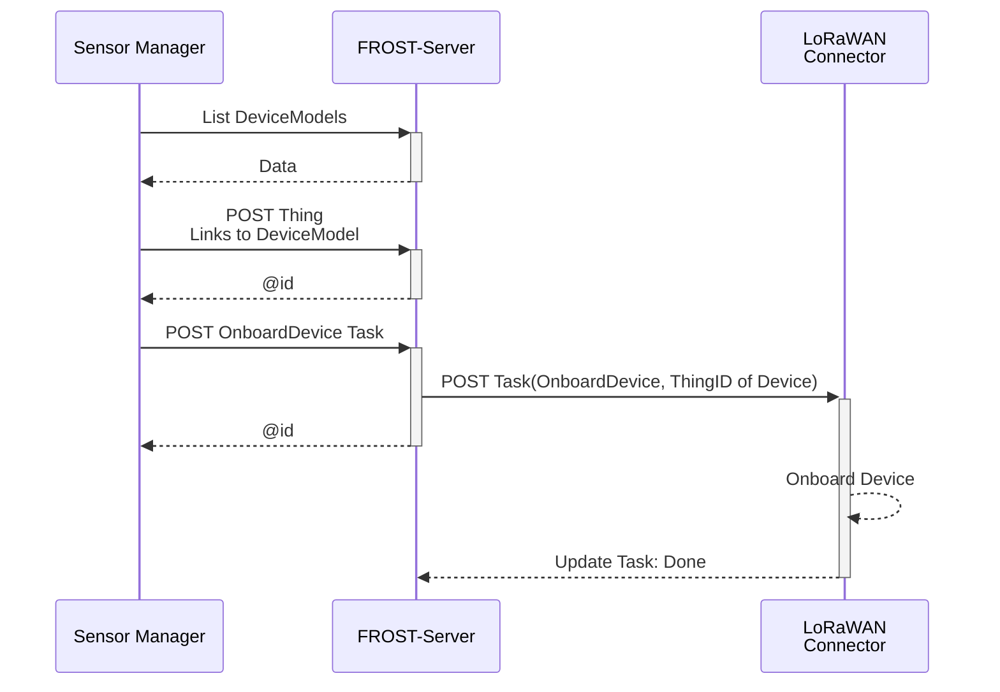
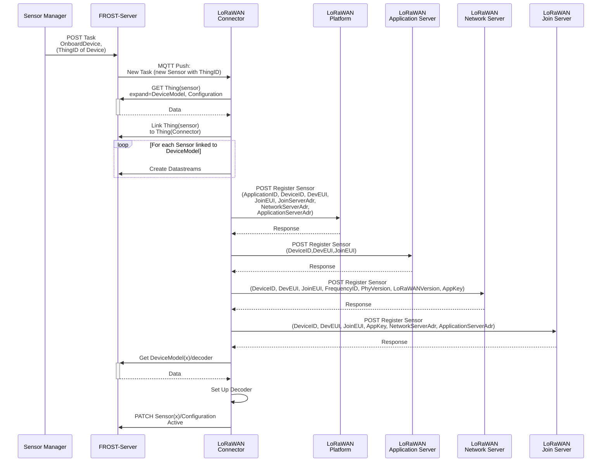

# OpenCitySense Data Model Plugin

To make the complexities of sensor management more manageable, Fraunhofer IOSB started an internal research project to design the concept for a sensor management system, based on the OGC SensorThings API, and create an implementation of this system.

Since the [SensorThings API version 1.1](https://docs.ogc.org/is/18-088/18-088.html) is extendible by design, and already comes with several extensions, the architecture can be greatly simplified by using the SensorThings API service as the central data store for all sensor related data (figure below).
This means that all components communicate through a single service, reducing the number of interconnects between components and reducing the spread of primary information across components.

The standard [tasking extension](https://docs.ogc.org/is/17-079r1/17-079r1.html) can be used to coordinate management actions between components, such as signalling to a connector that a sensor needs to be on-boarded, that a configuration needs to be changed, or that a sensor needs to be off-boarded.
The connector concept can then be extended to not just be a one-way ETL process, but to take an active role in the sensor registration process on the LoRaWAN stack.
It can receive information about new or updated sensors from the SensorThings service, and automatically take all required registration actions in the communication infrastructure.

Besides greatly simplifying the architecture, a second major advantage to using the SensorThing API service for all data storage is that it offers a consistent, powerful API for managing relational data.
This makes all data relevant for managing sensors and their data available in a unified, consistent way, and management tools or other clients do not need to implement multiple APIs.
While all publicly relevant sensor data and metadata can be stored in the core data model of the SensorThings API, internal management data can be stored in a custom data model extension.
Since this does not alter the core data model of the SensorThings API, clients implementing only the Sensing part will not be affected by this data model extension.

Sensor configuration parameters are modelled using the [SWE Common Data Model Encoding Standard](https://www.ogc.org/publications/standard/swecommon/), and translated by the connector into a form that the sensor understands.
This means that regardless of sensor brand or type, the management GUI can offer a consistent interface for changing sensor settings.

## Data Model

To allow the representation of device management information, a data model extension has been designed for the data models of the SensorThings API and the tasking extension.
The extended data mode is depicted in the following image.

Connectors and Devices are modelled as Things.
To make it easier to distinguish between different types of Things, a "type" field has been added to the Thing entity type that indicates the type of the thing.
Things of type "Connector" are linked to the Things of the devices they manage, through the ControlledDevices <-> ControllingConnector relation.
This makes it easy to find all the devices controlled by a certain connector, and to find the connector controlling a certain device.

Each Thing can have a DeviceModel, describing the capabilities of the Device or Connector.
A DeviceModel contains the schema for the Configurations of devices of this model, and can link to a Configuration that is the template or default configuration of devices of this model.
DeviceModels can link to a Decoder that can be used to decode and encode data coming from and sent to devices of this model.

DeviceModels link to Sensors that describe the Sensors that a device of the model has.
In turn, Sensors link to the ObservedProperties that a Sensor of this type observes.
Using these two links, a Connector knows which Datastreams to create and which Sensor and ObservedProperty to link, when onboarding a Device.

DeviceModels link to the DeviceModels of the Connectors that they are compatible with.
This allows a user interface to find the DeviceModels that work on a chosen Connector, and allows the Connector to specify additional configuration options it requires on a Device and a DeviceModel.

Configurations describe how a device can be, was or is configured.
The schema for the config is stored in the DeviceModel of the device.
The status field of a configuration indicates the current status of a sensor (Created, Active, Inactive, Removed) or if the Configuration is a Template.
Configurations have a time field that indicates when this configuration became active.
If a device has multiple configurations there must be only one configuration with status "Active".
The other configurations are historical Configurations or templates.

To allow the secure storage of passwords or API keys, the DeviceSecret class was added to the data model.
The secrets can be secured, both by only giving certain users read-access to these device secrets, and by encrypting the values of the device secrets.
To allow Encryption, a connector has a public/private key pair.
The private key of a connector is not stored in the SensorThings data model, but directly passed to the connector, usually using an environment variable.
The public key of the connector is available in the SensorThings data model and can be used by clients to encrypt passwords before storing them in a DeviceSecret entity.
This way only the connector can decrypt these secrets.

## Configuration Definitions

A device generally has two types op parameters: Fixed ones that can not be changed during the operation of the device, and dynamic ones that can be changed.

The dynamic parameters are independent of the Connector used to manage the device.
These parameters are specified in the section `configuration` of the `configDefinition` attribute of the `DeviceModel`, and the values for these are stored in the `config` attribute of the active `Configuration` entity linked to the device.

The static parameters are (can be) connector-specific.
They are stored in the properties of the _device_ (Thing), as secret linked to the _device_ or in the properties of the _DeviceModel_.
The definition of these parameters is stored in section `configuration` of the `configDefinition` attribute of the _DeviceModel_ of the _connector_.

The configDefinition of a DeviceModel may thus have three sections:

- `configDefinition/configuration`: Definitions of fields that can be added to te `Configuration` of devices of this `DeviceModel`.
  These fields should be shown when creating a new  device, or when changing the configuration of a device.
- `configDefinition/device`: Definitions of fields that the connector requires in the `properties` or a `DeviceSecret` of a `Thing` that it manages.
  These should be shown when creating a new device.
- `configDefinition/deviceModel`: Definitions of fields that the connector requires in the `properties` of a `DeviceModel` of devices that it manages.
  These should be shown when creating a new DeviceModel, or when linking an existing DeviceModel to the DeviceModel of a Connector.

## Onboarding Workflow

From the point of view of the User Interface the workflow for onboarding a sensor is as follows:

Assuming a suitable DeviceModel already exists for the device to be onboarded, the user interface only needs to create a Thing for the device and then create a Task for the connector to onboard the device.
Most of the work is done by the Connector, as can be seen in the workflow focusing on what the Connector does after the onboarding Task is created:

