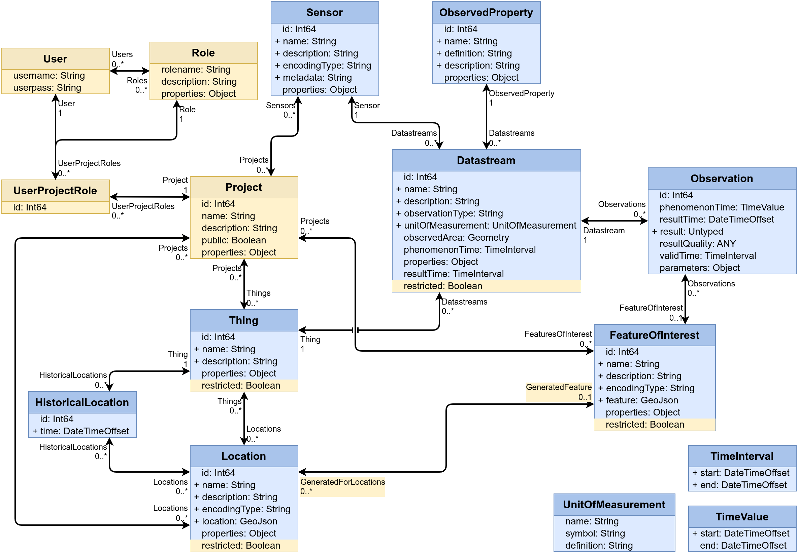

# Projects Data Model Plugin

A fine-grained security definition for FROST-Server, based on Projects.

## Users, Projects, Roles, UserProjectRoles

**Users** are actors that can log in. Users are stored in the `USERS` table. Test users are:
- read
- write
- admin

The `Users` entity type is visible to all users, but normal users can only see their own User entry.
Only global-admin users and project-admin users can see all users.
Password are not visible to anyone, not even to admin users.

Users can change their own password.

**Roles** embody sets of permissions that a user can have. Roles are stored in the `ROLES` table. Test roles are:

- read
- create
- obscreate
- update
- delete
- admin

The `Roles` entity type is only visible to admin users.

Users can have global Roles. The global roles are stored in the `USER_ROLES` table that directly links Users to Roles.

- A global admin user is allowed to do everything.
- A user with a global "create" role is allowed to create all entity types except for Users and admin-only types (Roles, UserProjectRoles).
- A user with a global "read" role can read all entities, except for other User entities or admin-only types.

**Projects** are administrative entities grouping data (through Things).
Projects are stored in the `PROJECTS` table.
Projects can be public or private.
Public projects, and their associated Things, Datastreams, etc., can be read by everyone.
Private projects, and their associated Things, Datastreams, etc., can only be read by users associated to the project.

Users can have project-roles. Users are linked to a Project with a certain Role through the `USER_PROJECT_ROLE` table.

**UserProjectRoles** Link a User with a specific Role to a Project. A User can have multiple Roles in the same Project.

The `UserProjectRoles` entity type is only visible to admin users.

Users without a global "read" role, but with a project-related "read" role can only read Observations that have a Datastream that has a Thing that is linked to a Project that the user is in.

**Things**, **Locations**, **Datastreams** and **FeaturesOfInterest** can be restricted.
This means that even if they are associated with a public project, they can still only be read by users associated to that project.
When not explicitly specified, these Entities will *not* be restircted by default.

**Locations** and **FeaturesOfInterest** have their normally hidden link exposed, that indicates that a FeatureOfInterest is autogenerated for a specific Location.
This means that, when creating a Location, the FeatureOfInterest that will be used for Obserations that do not specify one, can directly be created as well.

## Data Model

The image below shows the core STA data model in blue, with the security extension in yellow.

