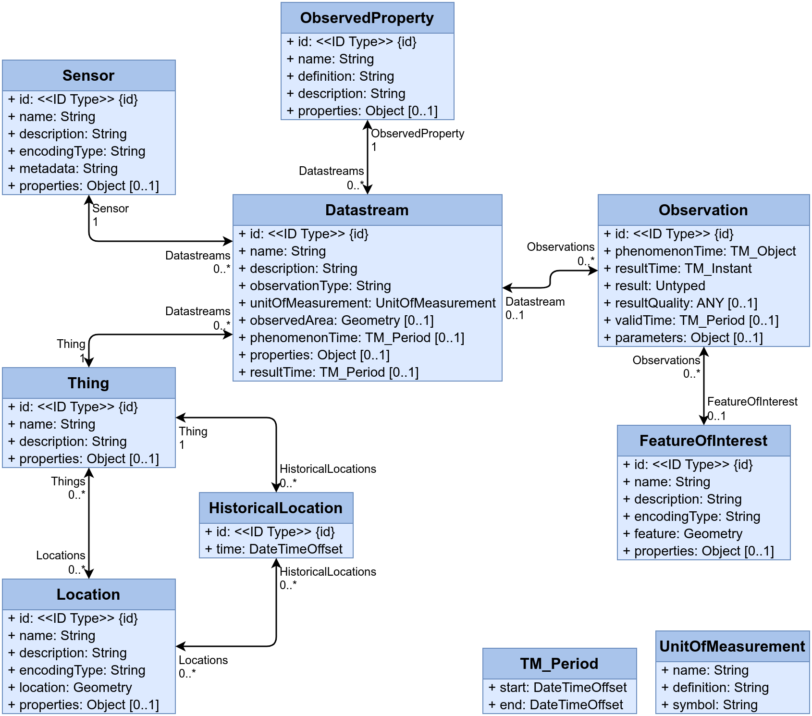
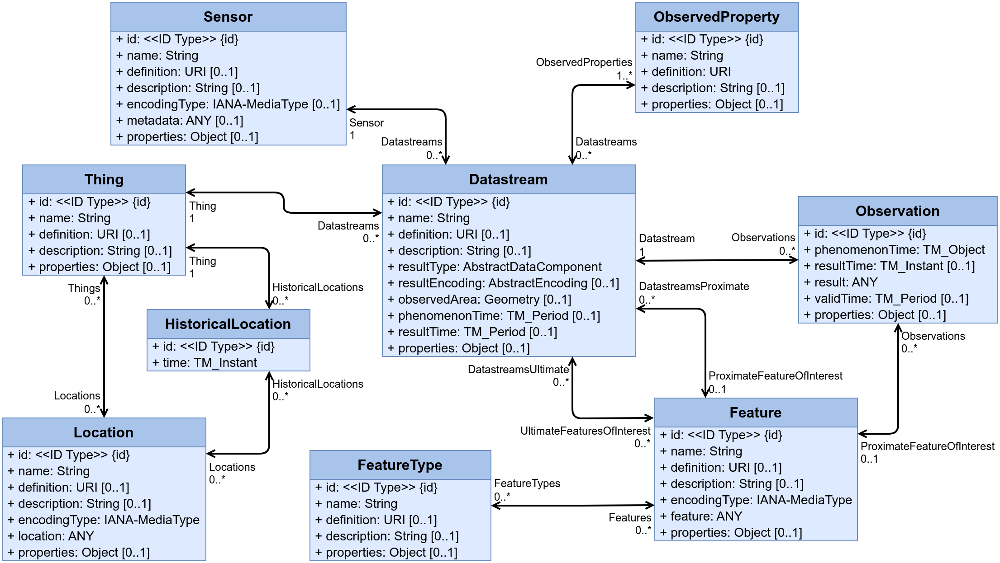

# SensorThings Data Model & API Plugin

The original data model that was hard-wired in FROST versions 1.x is now a plugin in FROST versions 2.0 and later.
Since the data model of SenosrThings API version 2.0 is significantly different from the version 1.1 model, it has its own plugin.
Only one of the two data model plugins can be activated at the same time.

The APIs of the SensorThings specifications are also implemented as plugins that can be enabled separately from the data model plugins.
The API plugins do not interfere with each other and can be activated at the same time.
This means you can use either SensorThings data model with either API plugin, or with both at the same time.

## SensorThings Data Model Version 1.1

See the [official documentation](https://docs.ogc.org/is/18-088/18-088.html) for the details on the data model.

## SensorThings Data Model Version 2.0

See the official documentation for the details on the data model.

