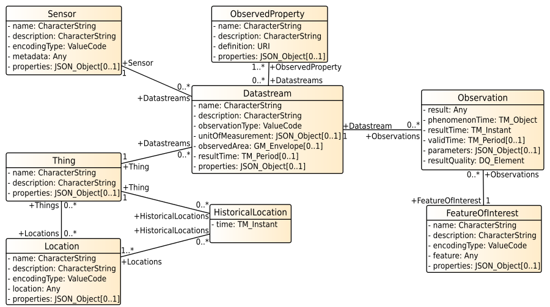

# Creating New Entities

The OGC SensorThings API does not just allow you to read data, it is possible to create, update and delete all data too.
As an exercise we'll create the data model for a temperature sensor in our kitchen.

## Creating basic entities

Creating is done by making a http POST to a collection.
For instance, to create a new Thing, the JSON description of the Thing is posted to `v1.1/Things`:

```
POST https://example.org/FROST-Server/v1.1/Things
```
```javascript
{
  "name" : "My Kitchen",
  "description" : "The kitchen in my house",
  "properties" : {
    "oven" : true,
    "heatingPlates" : 4
  }
}
```

## POSTing to FROST-Server

How do you make a POST request? With your web browser!
You can use a browser plugin, like RESTClient (for Firefox) or Postman (Google Chrome), but since recently, the FROST-Server
landing page has a handy little form that you can used to POST entities to your server.

If you run a server on your own machine, with Docker, you can find it at: 

> [http://localhost:8080/FROST-Server/](http://localhost:8080/FROST-Server/)


If you do not have your own server you can use our public demo instance at:

> [https://ogc-demo.k8s.ilt-dmz.iosb.fraunhofer.de/](https://ogc-demo.k8s.ilt-dmz.iosb.fraunhofer.de/)

Lets create a Thing. If you use our shared server, make sure you put your (nick)name in the name or
definition of the Thing you create, so you can find it back later!

After succesfully creating an entity the server responds with a header containing the URL of the newly created entity:
```
Location: https://ogc-demo.k8s.ilt-dmz.iosb.fraunhofer.de/v1.1/Things(19)
```
Try to to remember the number at the end of this URL, so you don't have to look it up later!


## What entities to create, in which order

All entities can link to other entities. In some cases, these relations are mandatory.
For instance, a Datastream must link to a Thing, a Sensor and an ObservedProperty.
The Datamodel shows all these relations:



This means there is a certain order in which the entities must be created.
It's impossible to create an Observation without a Datastream.
The usual order is:

1. Thing
1. Location
1. _ObservedProperty_
1. _Sensor_
1. Datastream
1. Observation (+FeatureOfInterest)

ObservedProperties and Sensors are often shared across many Datastreams.
You only need one definition of `Temperature` in your server.
Sensors are also often shared among all Datastreams the hold data for the same _type_ of sensor, though in some
use cases there is a separate Sensor entity for each actual sensor.

We have a Thing. Now we need to create a Location, but how do we link it to our Thing?


## Creating a Location and linking to to your Thing

When creating an entity that needs to link to an already existing entity, the ID of that related entity can be specified in the JSON of the Entitiy we want to create.
A Location has a many-to-many relation with Thing, so each `Location` has a property `Things` that is an Array:

```javascript
{
  "name": "Location of my kitchen",
  "description": "This is where my kitchen is",
  "properties": {},
  "encodingType": "application/geo+json",
  "location": {
    "type": "Point",
    "coordinates": [8.10, 50.00]
  },
  "Things": [
    { "@iot.id": 999}
  ]
}
```
You'll have to replace the value of the `"@iot.id"` of the Thing with the value of the id of the Thing you just created.

Further important properties of a Location are `encodingType` and `location`.
The `location` property is the actual geometry of the Location.
The `encodingType` property describes the type of this geometry.
The most common type of geometry is [GeoJSON](https://tools.ietf.org/html/rfc7946).
Beware the lon/lat coordinate order!

To create this Location, go to the HTTP tool on the FROST-Server landing page, and change the URL to
`v1.1/Locations`, paste the JSON in the textBox, make sure `POST` is selected in the dropdown and click `Execute`.


## Creating a Sensor and ObservedProperty

Next we create a Sensor and an ObservedProperty.


### ObservedProperty

ObservedProperties are created by posting to `v1.1/ObservedProperties`.
Try to remember the ID of the entity when it is created.

```javascript
{
  "name": "Temperature",
  "description": "Temperature",
  "properties": {},
  "definition": "http://dd.eionet.europa.eu/vocabularyconcept/aq/meteoparameter/54"
}
```


### Sensor

Sensors are created by posting to `v1.1/Sensors`.
Try to remember the ID of the entity when it is created.

```javascript
{
  "name": "HDT22",
  "description": "A cheap sensor that measures Temperature and Humidity",
  "properties": {},
  "encodingType": "application/pdf",
  "metadata": "https://www.sparkfun.com/datasheets/Sensors/Temperature/DHT22.pdf"
}
```

## Datastreams

All Observations go into a Datastream, so next up is creating a Datastream for our use case.
The Datastream requires a Thing, Sensor and ObservedProperty. 
The following example crates a Datastream, and links to an existing Thing, Sensor and ObservedProperty.
Just replace the IDs with the ones you created:

```
POST v1.1/Datastreams
```
```javascript
{
  "name" : "Temperature in the Kitchen",
  "description" : "The temperature in the kitchen, measured by the sensor next to the window",
  "observationType": "http://www.opengis.net/def/observationType/OGC-OM/2.0/OM_Measurement",
  "unitOfMeasurement": {
    "name": "Degree Celsius",
    "symbol": "°C",
    "definition": "ucum:Cel"
  },
  "Thing": {"@iot.id": 999},
  "Sensor": {"@iot.id": 999},
  "ObservedProperty": {"@iot.id": 999}
}
```


## Observations

Finally, lets create an Observation.
When creating Observations there are some additional rules:
- If the phenomenonTime is not given, the server will use the current time as phenomenonTime.
- If the featureOfInterest is not given, the server will use a FeatureOfInterest generated from the Location of the Thing of the Datasteam.
- If the resultTime is not given, the value `null` is used.


```
POST v1.1/Observations
```
```javascript
{
  "result" : 21,
  "Datastream": {"@iot.id": 999}
}
```

It is also possible to specify one of the relations of an enitity in the URL of the POST instead of in the JSON.
In the following example, the post is made to `v1.1/Datastreams(999)/Observations`, i.e. to the collection of Observations belonging to Datastream 999.
This automatically links the new Observation to Datastream 999.
```
POST v1.1/Datastreams(999)/Observations
```
```javascript
{
  "result" : 22
}
```


